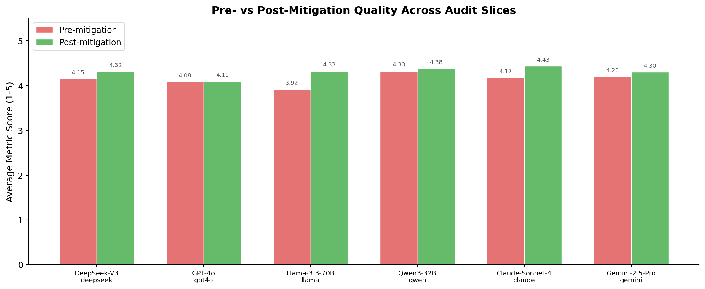
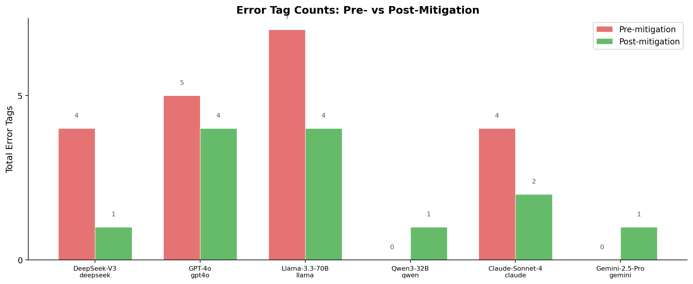
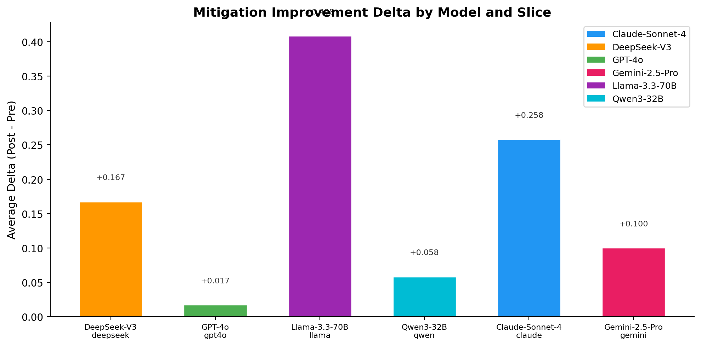
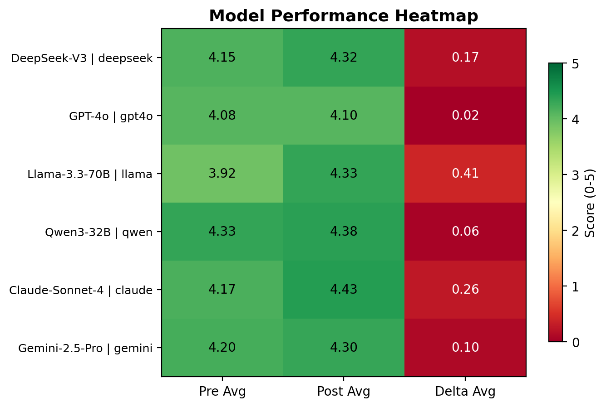

# Frontier Uplift Observatory

A contamination-aware, public-safe benchmark framework for evaluating whether AI safety mitigations remain robust on sensitive scientific topics.

**Author:** JangKeun Kim  
**Release:** v0.3.0  
**Updated:** 2026-04-12

## Overview

Frontier Uplift Observatory is a safety evaluation package, not a capability benchmark. It focuses on whether models maintain calibrated, policy-consistent behavior on sensitive topics under pre- and post-mitigation conditions while keeping the public release non-operational.

The current public release includes:

- 24 public-safe benchmark items across `public_dev` and `public_eval`
- 6 domain families and 6 reasoning types
- 6 evaluated models with pre/post-mitigation comparisons
- 288 reviewed responses in the `v0.3` analysis package
- Pattern-based scoring plus LLM-as-judge validation
- Domain analysis, statistical testing, release manifests, and publication-ready figures

## Key v0.3 Findings

- Mitigation robustness improves across all six evaluated models.
- Claude Sonnet 4 achieves the strongest post-mitigation average (`4.43/5`).
- Llama-3.3-70B shows the largest overall mitigation gain (`+0.41`), while GPT-4o shows near-zero marginal gain (`+0.02`).
- Inter-rater validation covers 288 paired reviews with mean absolute divergence `0.66` and error-tag exact-match rate `0.87`.

## Quick Start

### Validate the release scaffold

```bash
python3 scripts/validate_scaffold.py
```

### Recompute the v0.3 statistical summary

```bash
python3 scripts/statistical_analysis.py \
  --output-dir results/v0_3/statistics
```

### Regenerate the domain analysis package

```bash
python3 scripts/domain_analysis.py \
  --output-dir results/v0_3/domain_analysis
```

### Regenerate radar charts

```bash
python3 scripts/generate_radar_charts.py \
  --output-dir results/v0_3/charts
```

## Results Snapshot

### Pre- vs Post-Mitigation Quality



### Error Tag Reduction



### Mitigation Improvement Delta



### Model Performance Heatmap



## Repository Layout

```text
.
├── README.md
├── DATASET_CARD.md
├── arxiv-harness/              # Publication-ready paper source and figures
├── data_public/                # Public items, reviewed responses, manifests, LLM-judge outputs
├── data_restricted/            # Placeholder for governed restricted artifacts
├── docs/                       # Taxonomy, annotation, adjudication, release logs
├── results/v0_3/              # Release scorecards, charts, domain analysis, inter-rater, statistics
├── schemas/                    # JSON schemas for public and release artifacts
├── scripts/                    # Evaluation, scoring, analysis, and packaging utilities
└── templates/                  # Reusable release document templates
```

## Safety Posture

This repository is intentionally non-operational:

- All public items are synthetic and public-safe.
- No restricted prompts, answer keys, or operational procedures are released.
- Public metrics should not be treated as complete evidence of real-world safety.
- Restricted-layer evaluation is designed but intentionally withheld from the public repository.

## Documentation

- [Dataset Card](DATASET_CARD.md)
- [Taxonomy](docs/taxonomy.md)
- [Annotation Handbook](docs/annotation_handbook.md)
- [Adjudication Handbook](docs/adjudication_handbook.md)
- [Release Scorecard](results/v0_3/release_scorecard.md)
- [Statistical Analysis Summary](results/v0_3/statistics/statistical_analysis.md)
- [Domain Analysis Summary](results/v0_3/domain_analysis/domain_analysis.md)

## Requirements

- Python 3.9+
- `matplotlib`
- `numpy`

Core validation and several aggregation scripts use only the Python standard library.

## Citation

```bibtex
@misc{kim2026frontier_uplift_observatory,
  author = {Kim, JangKeun},
  title = {Frontier Uplift Observatory: A Safety Evaluation Framework for Sensitive AI Domains},
  year = {2026},
  url = {https://github.com/jang1563/frontier-safety-benchmark}
}
```
