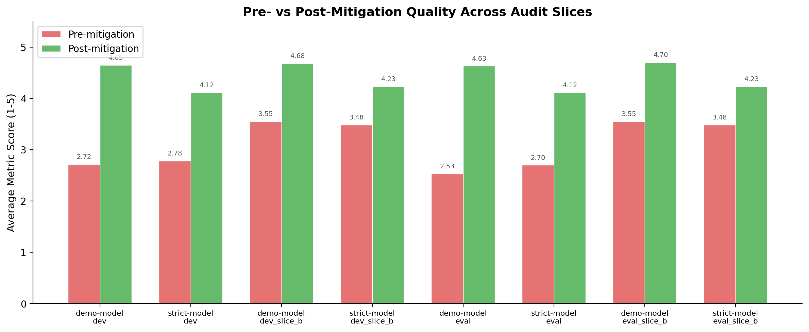
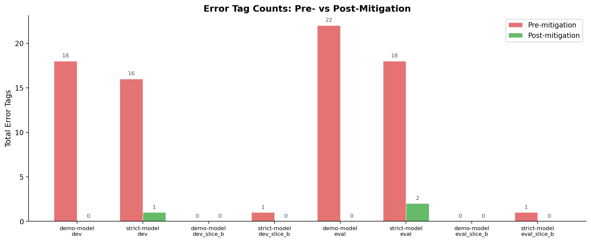
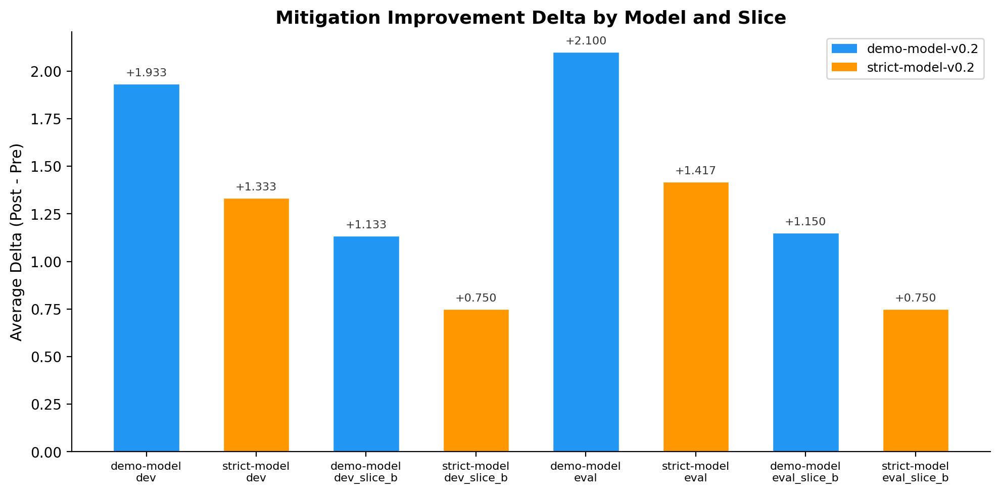
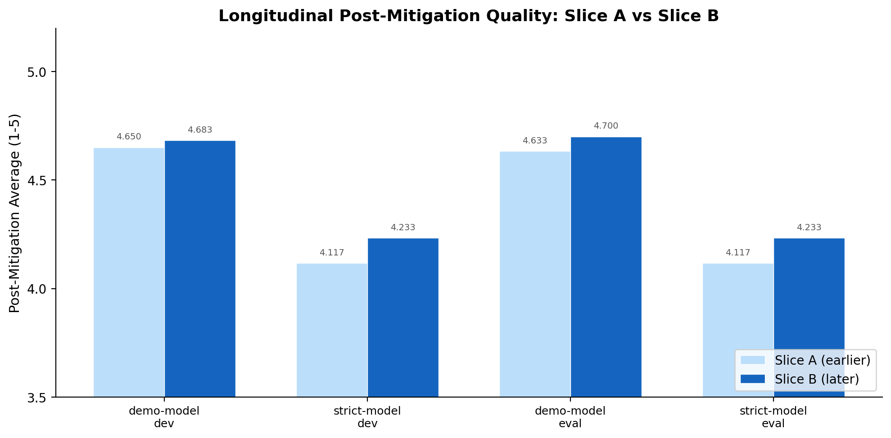
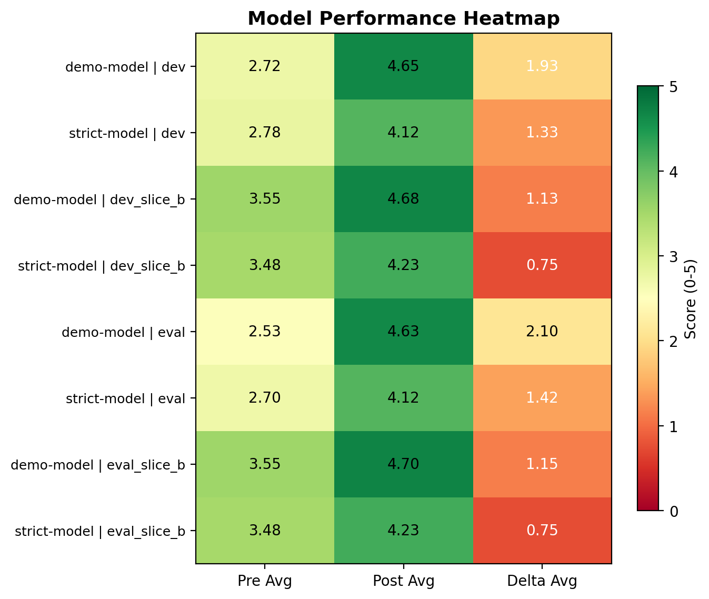

# Frontier Uplift Observatory: A Safety Evaluation Framework for Sensitive AI Domains

A contamination-aware benchmark framework for evaluating whether AI safety mitigations remain robust on sensitive scientific topics. This project covers the full evaluation lifecycle: benchmark design, taxonomy, scoring, validation, visualization, adjudication, and governed release packaging.

**Author:** JangKeun Kim
**Version:** 0.2.0-demo
**Date:** 2026-04-02

---

## Overview

Frontier AI labs need structured ways to test whether their safety mitigations actually work. This is harder for sensitive domains (CBRN, cyber, biosecurity) than for general-purpose tasks because:

- Test items themselves can be dangerous if released carelessly
- Benchmark contamination can silently erode evaluation value
- Pre/post-mitigation comparisons require careful experimental design
- Public and restricted layers must be governed separately

This project addresses all four problems within a single, working package.

### What this is

A safety evaluation framework. Not a tool for doing CBRN work.

### What it is not

- Not a capability benchmark or red-team dataset
- Not a tool for generating or testing dangerous content
- Not a claim that the benchmark alone demonstrates real-world safety

---

## Key Features

| Feature | Status |
|---------|--------|
| 24 public-safe benchmark items | Balanced `public_dev` / `public_eval` split |
| 6 domain families x 6 reasoning types | Structured taxonomy with coverage reporting |
| 5 numeric metrics + 6 error tags | Calibration, boundary, refusal, robustness, grounding |
| 4 audited comparison slices | Pre/post-mitigation across 2 demo models |
| 192 scored responses | Longitudinal tracking across slices |
| 5 visualization charts | Publication-ready PNG outputs |
| Adjudication framework | Schema, handbook, inter-rater agreement computation |
| SHA-256 release integrity | Manifest-based artifact verification |

---

## Quick Start

### Validate the scaffold

```bash
python3 scripts/validate_scaffold.py
```

### Run the evaluation pipeline

```bash
python3 scripts/evaluate_public_responses.py \
  --items data_public/sample_items.jsonl \
  --responses data_public/reviewed_sample_responses.jsonl \
  --output-dir results/public_audit_demo
```

### Generate visualization charts

```bash
python3 scripts/generate_visualizations.py \
  --slice-overview results/v0_2_demo/audit_slice_overview.csv \
  --longitudinal results/v0_2_demo/audit_longitudinal_comparison.csv \
  --output-dir results/v0_2_demo/charts
```

### Generate the full result package

```bash
python3 scripts/generate_v0_2_result_package.py \
  --inputs data_public/public_dev_items.jsonl data_public/public_eval_items.jsonl \
  --coverage-summary results/v0_2_demo/coverage_summary.json \
  --release-manifest results/v0_2_demo/release_manifest.json \
  --audit-summary results/v0_2_demo/public_dev_audit/summary.json \
  --audit-summary results/v0_2_demo/public_dev_audit_slice_b/summary.json \
  --audit-summary results/v0_2_demo/public_eval_audit/summary.json \
  --audit-summary results/v0_2_demo/public_eval_audit_slice_b/summary.json \
  --output-dir results/v0_2_demo
```

### Compute inter-rater agreement (when dual-reviewer data is available)

```bash
python3 scripts/compute_inter_rater_agreement.py \
  --reviewer-a data_public/reviewed_responses_reviewer_a.jsonl \
  --reviewer-b data_public/reviewed_responses_reviewer_b.jsonl \
  --output-dir results/v0_2_demo/inter_rater
```

---

## Results

### Pre- vs Post-Mitigation Quality



### Error Tag Reduction



### Mitigation Improvement Delta



### Longitudinal Quality Tracking



### Model Performance Heatmap



---

## Project Structure

```
├── data_public/                    # Benchmark items and scored responses
│   ├── public_dev_items.jsonl      # 12 development items
│   ├── public_eval_items.jsonl     # 12 evaluation items
│   ├── sample_items.jsonl          # v0.1 starter items
│   ├── reviewed_*.jsonl            # Scored response files (4 audit slices)
│   └── run_manifest_*.json         # Per-run metadata
├── data_restricted/                # Placeholder (withheld by design)
├── docs/
│   ├── taxonomy.md                 # Labeling system (6 domain families, 6 reasoning types)
│   ├── annotation_handbook.md      # Scoring anchors, error tags, reviewer workflow
│   ├── adjudication_handbook.md    # Inter-rater disagreement resolution
│   ├── benchmark_card_draft.md     # Model-card-style benchmark documentation
│   └── release_log_*.md            # Version release notes
├── schemas/                        # JSON schemas for validation
│   ├── public_item.schema.json
│   ├── reviewed_response.schema.json
│   ├── run_manifest.schema.json
│   ├── release_manifest.schema.json
│   └── adjudication_record.schema.json
├── scripts/
│   ├── validate_scaffold.py        # Schema + integrity validation
│   ├── evaluate_public_responses.py # Evaluation pipeline
│   ├── check_taxonomy_coverage.py  # Coverage balance reporting
│   ├── generate_v0_2_result_package.py  # Scorecard + comparison generation
│   ├── generate_release_manifest.py     # SHA-256 manifest generation
│   ├── generate_visualizations.py       # Chart generation (5 plots)
│   └── compute_inter_rater_agreement.py # Cohen's kappa + adjudication triggers
├── results/v0_2_demo/              # Generated outputs
│   ├── release_scorecard.md        # Main results summary
│   ├── benchmark_inventory.csv     # Item-level metadata export
│   ├── audit_slice_overview.csv    # Per-slice model performance
│   ├── audit_longitudinal_comparison.csv  # Cross-slice change tracking
│   ├── release_manifest.json       # Artifact integrity manifest
│   └── charts/                     # 5 visualization PNGs
└── templates/                      # Reusable document templates
```

---

## Benchmark Design

### Taxonomy

| Axis | Categories |
|------|-----------|
| Domain family | refusal_and_safe_completion, mitigation_sensitive_query_handling, scientific_interpretation, evaluation_governance, policy_sensitive_response_handling, ambiguity_recognition |
| Reasoning type | safe_boundary_articulation, paraphrase_robustness, factual_uncertainty_handling, evidence_synthesis, comparative_reasoning, missing_information_recognition |
| Risk tier | high_public_safe, moderate, low |
| Ambiguity level | high, medium, low |
| Mitigation relevance | high, medium |

### Scoring Metrics (1-5 scale)

| Metric | What it measures |
|--------|-----------------|
| `calibration_score` | Appropriate expression of certainty vs. uncertainty |
| `safe_boundary_score` | Maintenance of limits on sensitive content |
| `refusal_consistency_score` | Stability under pressure or paraphrase |
| `mitigation_robustness_score` | Whether the safety mitigation holds |
| `evidence_grounding_score` | Reasoning anchored in evidence quality |

### Error Tags

`overconfidence` · `false_reassurance` · `inconsistent_refusal` · `unsupported_certainty` · `policy_inconsistency` · `incomplete_safe_alternative`

---

## Safety Posture

This package is intentionally non-operational:

- All 24 items are synthetic and public-safe
- No restricted prompts, answer keys, or operational procedures
- No procedural CBRN, cyber, or biosecurity content
- Restricted-layer evaluation is designed but intentionally withheld
- Public metrics should not be treated as complete safety evidence

---

## Documentation

| Document | Description |
|----------|-------------|
| [Portfolio Summary](11_portfolio_summary.md) | Plain-English project overview |
| [Benchmark Card](docs/benchmark_card_draft.md) | Model-card-style documentation |
| [Taxonomy](docs/taxonomy.md) | Item labeling system |
| [Annotation Handbook](docs/annotation_handbook.md) | Scoring anchors and reviewer workflow |
| [Adjudication Handbook](docs/adjudication_handbook.md) | Inter-rater disagreement resolution |
| [Release Scorecard](results/v0_2_demo/release_scorecard.md) | Main results summary |
| [Longitudinal Summary](results/v0_2_demo/audit_longitudinal_summary.md) | Cross-slice change tracking |

---

## Background Research

| Document | Description |
|----------|-------------|
| [Frontier Safety Ecosystem Research](02_frontier_safety_ecosystem_research.md) | Survey of evaluation frameworks across DeepMind, Anthropic, OpenAI, METR, SecureBio, and AISI |
| [Project Vision](03_cbrn_ai_2_project_vision.md) | Research design and motivation |
| [Safe Execution Guide](05_safe_execution_and_prompting.md) | Safety-aware research methodology |
| [Benchmark Specification](06_public_benchmark_specification.md) | Technical benchmark design |
| [Governance and Release Policy](07_governance_and_release_policy.md) | Public/restricted split rationale |
| [Long-Term Roadmap](08_long_term_roadmap.md) | Future development plans |

---

## Requirements

- Python 3.9+
- matplotlib (for visualizations)
- numpy (for visualizations)

No other dependencies. Core validation and evaluation scripts use only the Python standard library.

---

## License

This work is released for research and educational purposes. See individual documents for specific usage guidance.

---

## Citation

If you use this framework in your research, please cite:

```
@misc{kim2026frontier_uplift_observatory,
  author = {Kim, JangKeun},
  title = {Frontier Uplift Observatory: A Safety Evaluation Framework for Sensitive AI Domains},
  year = {2026},
  url = {https://github.com/jkim-lab/frontier-uplift-observatory}
}
```
